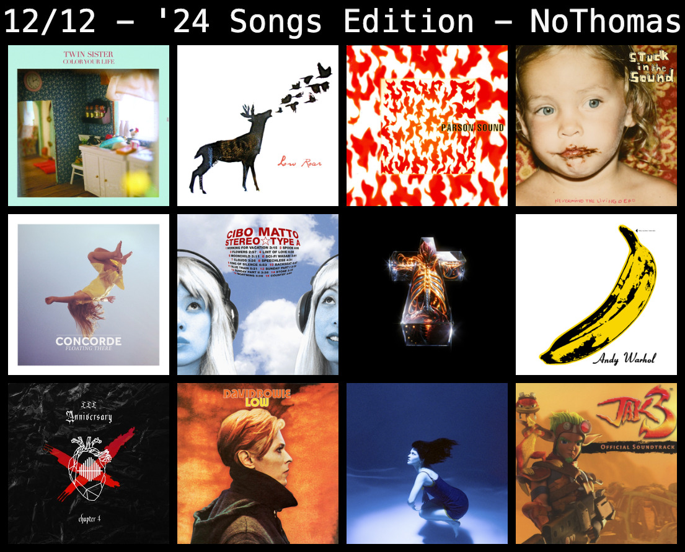

## 12 over 12

For once in a while, I've grown impatient for next year. When I was a child, I cringed at the thought of New Year's Eve and realizing my end-of-year school vacations were coming to an end. This feeling endured in my late year experiences throughout my high school & college years; Hell, even after working as a programmer for several years, I didn't really want the year to end. Last year I was obsessed with the idea of 2023 turning eternal; the same last week repeating _over, and over again..._ so that I could enjoy my PTO a bit longer and never have to return to the office. 

The latter half of that year had turned repetitive and there wasn't really any highlights in my life, not much to wake up for; little motivation towards anything. This year, even though I find myself transitioning from an unhappy software engineer, to a freelance or, "en-tre-pre-neur"-ish mode of life (I hate the current connotations this word possesses); where uncertainty clouds my near-future and evokes a sense of insecurity and anxiety on me, I find myself itching for New Year's Eve, impatient for what's to come, to the point that I had the brilliant idea to summarize the feelings, sensations and experiences I had the privilege of experiencing, with a collage of twelve songs, from twelve different artists, for each of the twelve months of the year; twelve, twelve, twelve, like the amount of numbers in a traditional wall clock.. Oh well, enough rambling, as I present to __YOU__ my 12 over 12 songs for 2024.

## January - Meet the Frownies - Mr. Twin Sister



__Contrary to its dreamy flirtations__ with the _lettuce of the devil_ (a.k.a. weed) and a relationship blossoming in a friend's yard in the song's lyrics, the reason why January is represented by Mr. Twin Sister's musical hit, _Meet the Frownies_, is because of a short adventure I had during that month, as a means to escape from everything that reminded me of my old job, if only temporarily. The waves of shoe gaze blasting in the cabin of the tiny airplane that sent me flying from Juan Santamaria's (SJO) airport, down to the miles long beaches tanning Nosara's coast along with a troop of celebrities, strange characters, gentrifying shake ups and surf memories that carried me to a short stay in the land where locals feel like foreigners in their own land.

__How could such a beautiful, hidden jewel__ evaporate to thin air so quickly, less than 12 years from when I enjoyed the empty beaches, in the cheap, rainy season, with family and friends? My childhood memories of Nosara's two famous beaches: Guiones and Pelada, were immediately tainted with a scenery of gringo café's and bungalows, who desperately tried to grasp the Californian spirit from a land that they snatched away from the Tico's at a fire sale, a fire sale the Costa Rican government encouraged, incentivized and fabricated through their lax land-leasing/land-purchasing and digital nomad regulations.

__Despite this sour image, I__ did find myself returning (if only for one day) to my old passion: Martial arts. There was a yoga/physical conditioning bootcamp near Guiones beach, where I had the fortune of meeting a great teacher who brought back the memories of those painful days filled with excitement and lust for living. I was never good at Boxing, Muay Thai, or Taekwondo, but back then in January, the _Nalu Studio_ offered some Boxing classes, and whenever I took Boxing, I felt completely in sync and at peace with my mind and body, as if every strike, every hook, every jab, expelled those bottled up emotions I kept over the years.

__Boxing wasn't the only activity__ during my three night stay at Nosara. I also started practicing surfing, receiving private classes with a Tico coach (Thank God). The few locals at the surf camp were shocked, mentioning to me how I was the first tico they've seen signing up for surfing classes, ever, and they kindly gave me the locals discount =) I spent my last afternoon at Guiones beach learning and failing at dominating the sea with my rented longboard, my rented long sleeved suit and a lovely sun blocker offered by my surf teacher. It was such a brief moment, but back then it felt nice to take on the challenge on learning how to surf, and I wish I'm able to return to the beach soon to hone my surfing skills. 

__All these moments__, along with my daily walks at Guiones and Pelada beach, submerging my awareness in the ocean waves clashing with the coast, bring back this dreamy pop song to my mind, as if whenever I visualize myself back there, somewhere, someone is blasting Andrea Estella's voice (Mr. Twin Sister's vocalist) right as I ride a rented bicycle through the golden dunes eroded by the salt water tides.

## February - Give Up - Low Roar



__February was a month in which I__ felt stressed over a lot of external factors. My mother needed to go under surgery for a malignant growth in her skin, and my return to work just a couple weeks prior was marked by a lot of team changes (Under my tenure at ActiveCampaign, I rotated teams at least five times), and I needed to juggle this delicate work life balance of mine, with my final french lessons (Oh la la). Low Roar has always found a way to soothe those feelings of despair that crept over my shoulders during these difficult times, its angelic voice emerging from Ryan Karazija's lips made me feel at peace, if only for the three minute duration of this underrated jewel.

__Ryan went on to create another__ three dream pop albums along with his group of musicians, before tragically passing away on October 2022, from sickness. His death, along with Bowie's passing are some of the events that have left a grueling impact in me, and millions of fans around the world, I'm sure of that...

## March - Tio Minuter - Parson Sound



__Water shortages in Costa Rica__ had already been around for most of February, and would stay here until late June. These water shortages went on for at least three days per week, from 7am to 7pm. It's hard to picture a world without such a basic necessity, and yet many people around the globe constantly drown in the quest to satiate their thirst. My outlook for Costa Rica looked quite bleak; Uncertainty, social disorder and a petri dish of crises droning around my head, __Tio Minuter__, from the now defunct Nordic psychedelic rock band, _Pärson Sound_, was the etiquette I thought about for this month, marking a period of constant anguish that's well identified with the loud horns and electrical drones buzzing in the ears of the listeners of __Tio Minuter__.

## April - Nevermind the Living Dead - Stuck in the Sound



__I was never a big fan of Stuck in the Sound__. During April, I was contacted by several companies, offering me the chance to apply to a niche of full-stack developer openings. Most of the time, I was assigned some take home assignments, and I listened to __Nevermind the Living Dead__, the album of the French rock group _Stuck in the Sound_ (SITS). The homologous track of the album, made me remember the times me and some childhood friends would play around the neighborhood, during the late 2000s and early 2010s. It made me wonder if those days were truly gone.. how could they be gone so quickly? 

__That was until late April__, when Erick (another childhood friend) and I received the devastating news from another childhood friend, Emmanuel: His beloved grandmother (who our family was very close with) had just passed away, a couple days prior. 

__Erick and I were there at the funeral__, not only to respect her memory, but also to uplift our friend's spirits (At the time, Emmanuel lived in the US, while his grandma lived here in CR). __Nevermind the Living Dead__ is a song that I can identify with this month, despite the singer's broken English in this song, the melodies made me remember how quickly time goes by, and how important it is to cherish those around you.

## May - Feelings (Blind Digital Citizen Remix) - Concorde



__May was my last month together with my old french class!__ It was also the month that culminated with my graduation from the 10th (and final) french level in the French Alliance. We threw a big party at a local celebrity's apartment, who I had the privilege of being classmates with for three whole levels (gracias Nancy!). May is also my birthday month! and since I reached the ripe age 24, I went to a local italian restaurant with my family so that I could enjoy some tasty pizza. The mood around the time was nostalgic, dense, uncertain, like those feelings evoked from the _Blind Digital Citizen_ remix of _Concorde_'s track, __Feelings__. Also, that month I used to drive early in the mornings to my swimming classes (6 AM) and I would play this song along the way.

## June - Spoon - Cibo Matto



__It's funny how I mentioned Italian cuisine__ in the previous month, while saving the Italian sounding group name _Cibo Matto_ for june (and no, _Cibo Matto_ is NOT an Italian music band). My interviews at a certain company, turned south at the very end, and I soon found myself having wasted more than 4 hours within __9 different interviews__. To throw some more salt to the wound, I was rejected a promotion by my boss that same month and I caught some awful cold that ruined my immune system for the latter half of June; the stress of my job and me preparing everything for all these job interviews, taxed my body spectacularly. June had a very accelerated, frenetic mood, and Cibo Matto's song __Spoon__ upbeat yet hyperactive tone reflects this accurately. A month of failures that went by quickly.

## July - Generator - Justice



__The Olympics__, my favorite time of the _Olympiad_ period (an Olympiad is a four-year period from the previous Olympics ceremony until the next). Justice was the main protagonist in July's musical scene, especially considering their newly released album, __HYPERDRAMA__, just a couple months back. July's song, __Generator__, was a breathe of fresh air. For me, this song is very intoxicating, rebellious, and I found it fitting when it played at the closing ceremony of the Paris 2024 Summer Olympics: The crowd echoing their cheers across the stadium, as the Olympic athletes parade triumphantly around the arena, showing pride in their achievements, something from these whole setting made me wish I was there, part of the Olympian army - a vague daydream emerging from a monotone lifestyle lacking of passion and meaning...

## August - Sunday Morning - The Velvet Underground & Nico



__The last Monday of August__, I had to drive myself to the SJO airport. Four years ago, I made a promise to my old friend Emilio, who was now living in Japan at the time, and I was just about to fulfill it. Monday August 30th marked my first solo intercontinental trip; From Costa Rica to Japan. During these last days of the month, I binged The Velvet Underground's first album. _Peel Slowly and See..._ - it's front-cover phrase always caught my attention, Warhol was a funny man indeed. 

__Even though I left on Monday__, I wanted to spend my last weekend as peaceful as possible. Who knows, it could've been my last, had the plane taken a deadly turn, and if I was going to die that day, then I wanted to eat some pizza, hang out with some friends, return home and tune in loop the famous Velvet Underground song, __Sunday Morning__. It sounded so fresh, so dreamy, as if I was transported back to childhood where I would roam around a giant supermarket's aisles, curious of the world around me, of the colourful products and aromas that governed the grocery store, or as if it transported me back to those early days in kindergarten, our lives unbothered by the rat race, and instead I found myself playing in the greeneries surrounding the playgrounds.

## September - THAT'S THE SOUND - EMILIO

__Self-explanatory__. I spent most of September in Japan, surrounded by its Shinto shrines, Royal castles, natural landscapes and neon bathed metropolis. I was there to fulfill a promise; To visit my friend, Emilio, and to assist one of its techno concerts. If you'd like to read more about how that went, you can check out the following article:



__And obviously__, I dedicated this month to his new song: [THAT'S THE SOUND (Original Mix)](https://soundcloud.com/brutalism_x_basseht/emilio-that-s-the-sound). An energetic techno piece that complemented my endless supply of adventures in the land of the rising sun. This will be the only song in the blog entry that's without a YouTube embed, but fear not, SoundCloud hosts this techno track, and if I find a way to integrate SoundCloud as a short code in the blog, then I'll update the blog entry so that it's easier to listen to _DJ EMILIO_ SoundCloud track =)

## October - Some Are - David Bowie



__It seems as if I was absorbed completely__, into a different reality just a month prior, in which I was ecstatic and full of energy. And now, heavy rain covered the distance whenever I looked outside, the drumming of droplets muffled all joy out of my self, as I found myself trapped at my breaking point: 

__A daily grind that had sucked my soul away__; A solitude that bathed me with each day that passed; And a country which suffocated me with stray bullets and socio-cultural desolation. My body yearned for adventure, for a way out of this place, but I found none of it, no thrill that made my heart skip, no trip to please the impatient mind that was ruminating on what to do next, as it was clear I had reached my limit at my previous job and soon after, took a leap of faith, by quitting and embracing this blog fully.

__Some Are__ - the unreleased track of Bowie's first Berlin Trilogy album: __Low__, captured these feelings, with its wolves crying from the distance, the single piano note from the ouverture dangling in preparation of the now-sober Starman whispering its lyrics. _Some are bound to fail, summer winter some... are_ - Bowie modulated in a wave of murmurs and sighed expressions; His exhaustion paralleled mine during this time; spiritually, mentally and physically. 

__During those rainy days__, I would mirror from under my eyelids, a pale white scenario in which my body sunk at the snow, now burgundy tainted from the open injuries across my physique, and then I'd force myself to climb the tundra in front of me, with my broken sleigh, as the wolves howled from a distance, spotting its next prey...

## November - Ay no puedo - The Marias



__Suffered some form of heartbreak__ at any point of your life? It's ok, so did I, and so did __Maria Zardoya__, the lead singer of the Puerto-Rican/American music group, _The Marias_. Her new album (__Submarine__) with her music group, steers away from the usual lovey-dovey, cinematic intensity of its predecessors without abandoning the psychedelic, latino-pop roots that characterized their early shows from the last decade.

__Submarine__ is a blue masterpiece, dwelling on the pain of letting someone else go, something us humans must deal with during love ruptures, while battling the efforts of the subconscious mind, constantly reminding us of the _What If's_ from a has-been relationship shattered to pieces. __Ay no puedo__ is a song that treats the dazzle that burns holes through the hearts of many, after a romance goes wrong. November fits this theme accurately for me at least.

## December - Jak III Credits Pt.2 - Josh Mancell & Larry Hopkins



__Last but not least__, December. This month, usually nostalgic for your dear author, usually glum too, was actually more upbeat than in previous years. The mood reminded me of a video game I used to play on circa 20 years ago in my PS2. _Jak III_ was the zenith of my all-time favorite video game franchise _Jak & Daxter_, and it went out grandiosely after you beat the final boss (Cyber-Errol and the Dark Makers) in the Wasteland, in order to redeem the betrayed protagonist and save the world. 

__The first part of the credits__ features a triumphant orchestra, congratulating the player for beating the game and completing the last adventure in the trilogy, but it's really the second part of the credit's theme composed by Josh Mancell & Larry Hopkins, that seals the deal for me. It offers a stark contrast to the champion's instrumental of the first half, by laying down a sense of certainty and excitement for what's to come, now that the war is finally over, a glimpse to the next generation, to the future. 

__The crescendos, the melodies and the soothing expansion of sounds__, it all sounds as if you were getting comforted by an invisible hand, telling you that no matter what's to come, you are not alone, and everything is going to be alright..
