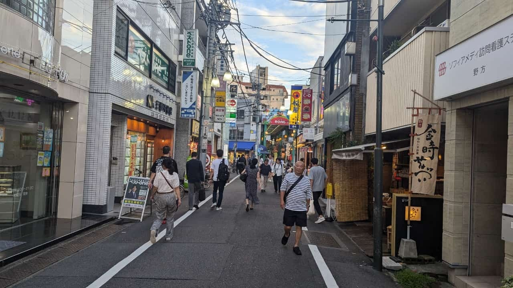

Haneda's Airport receives thousands of visitors every day, it's size could subvert your expectations completely even if you've already done your fair share of travelling around the world. I was one of the many adventurers who witnessed the endless morning that followed us from Newark to Haneda's airport for more than 14 hours. Due to timezones, if you leave in the morning from the US and fly through the Pacific, you're likely to experience the eternal morning phenomenon - as I like to call it - in which the sun refuses to set even after arriving to the Asian Archipielago; I finally understand why this place is called "The Land of the Rising Sun" =)

On landing, travellers are expected to move from the gates to the arrivals section. As with other airports, there's the possibility to connect flights and the signs hanging on the ceiling will let you know which path you should take in case you need to take another flight from the airport. Since this was my final destination, I followed the yellow billboard for domestic arrivals. Claiming checked bags can only happen once you've cleared customs and migration checks, which as expected from Japan, are strict and will not tolerate any illegal activites. You will also need to fill out some more japanese tax & immigration forms that luckily, are available online. From my experience, completing all forms in the official Japan Travel Web website, is way better than doing so by hand, as you can generate a QR code that immigration agents at the airport can scan to validate all your information. Afterwards, you will have to take your fingerprints and look straight towards the two cameras that will scan your face for security purposes. 

After these first two security levels, a final customs & clearance verification awaits you for completion before you're free to exit. Depending on how you completed the immigration and clearance forms (electronically or paper), you will have to either verify your QR code in the electronic kiosk along with your passport, or you will need to fill out another paper form and proceed to the "PAPER" queues so that an airport officer can approve your stay in Japan. Since I went the digital route, verifying my information in the electronic kiosk and then walking towards the "ELECTRONIC" queue before finally exiting the airport. Quite confusing, isn't it? Please make sure to know a little bit of Japanese or basic English at the very least in case you need help from the immigration officers. Be kind, patient and polite as you're arriving as a guest and must respect the culture.

## Stuff to do after exiting the airport

You should get yourself a prepaid train card (Pasmo or Suica) as soon as possible. Withdraw some Yen from the ATM, and move to your hotel/staying place. You can take the train (either JR Line, or local) and should be able to arrive to your destination shortly. There's also Uber, taxi and other riding apps to commute via private transportation, and if you have a license (depending on your country of origin), you can rent a car and drive to your destination yourself. However these last two options are really unnecesary as Japan's public transportation service is extremely good.

## Physical SIM Cards

Be sure to get a SIM card ASAP. A pre-paid, physical SIM card works best, but I wanted to try eSIM for the first time in my life, so I can't give a lot of detail on how to get a physical SIM card except for going to getting one of those outside the airport (If I recall correctly).

## eSIM

It's very easy to acquire electronic SIM cards (eSIM) in Japan. Personally, I used [bmobile traveller eSIM](https://www.bmobile.ne.jp/english/esim.html), which I found very convenient, except for the fact that you will need to purchase this quite early in the morning afternoon in order to obtain access immediately. If you purchase your eSIM after 20:00, you will have to wait until the day after at ~11:00 tops for your eSIM to activate. Be sure to enter all your details correctly, otherwise bmobile will reject your eSIM and you will have to start the process from scratch.

## Teishoku

I stayed for a day at Nakano, Tokyo, where I had the opportunity to visit a local restaurant that served *Teishoku*. Teishoku are Japanese classical set meals that are served in a wide range of restaurants across Tokyo (I can't talk about other regions but most likely there's Teishoku there too, after all it's still Japan).

")

## Shinjuku Express trip, and the rise (and fall) of Toyoko kids

")

There's an open space facing Toho Cinema in Shinjuku, a red zone that was once populated by vagabond children from near and distant lands. Today it serves as a reminder to the world, of the devastating consequences the pandemic brought back in 2019. Remnants of the original community of homeless kids that gathered around wearing clothes familiar from Japanese cartoons (anime) continue marking this place as one of the saddest in all of Tokyo.

## Morbid Parallels

If you've heard about the infamous community of minors in Berlin back in the 80s who escaped home to live on the streets and worked in sex-work while binging on heroin, then you would know how depressing it is to watch the future generations free-fall without any support net to catch them. The kids of the Zoo Station (*Der Kinder vom Bahnhof Zoo*) were notorious for coming from troubled home, and rapidly transforming into echoes of the heroin epidemic that slammed West Berlin in the mid-to-late 70s and propelled figures such as [Christiane F](https://en.wikipedia.org/wiki/Christiane_F.). and [Babsi Döge](https://da.wikipedia.org/wiki/Babette_D%C3%B6ge), the latter being plastered in local Berlin's newspapers as the youngest victim of the heroin epidemic sweeping away a generation in Germany. [A movie](https://en.wikipedia.org/wiki/Christiane_F._\(film\)) was also created back then documenting their gradual fall into addiction and their ultimate demise from heroin overdoses. 

What's currently happening in Japan is a strikingly similar situation to what happened at the Zoo Station in Berlin half a decade ago; Kids escaping from their homes, abandoning their abusing parents, pulling out their alcoholic drinks and cigarettes before proceeding to sell their bodies for quick cash. Its existence contradicts Japan's strict image, challenging long-established dogmas and once again bringing out a dark chapter in the history of Nippon. Will this culture find a way to thrive and grow away from their self-destructive lifestyles? Or will a new *Bahnhof Zoo* situation come to be and shake the core of Japan's social assistance system, putting into light its terrible flaws that enable these youths to slip into the cracks? Only time will tell..
