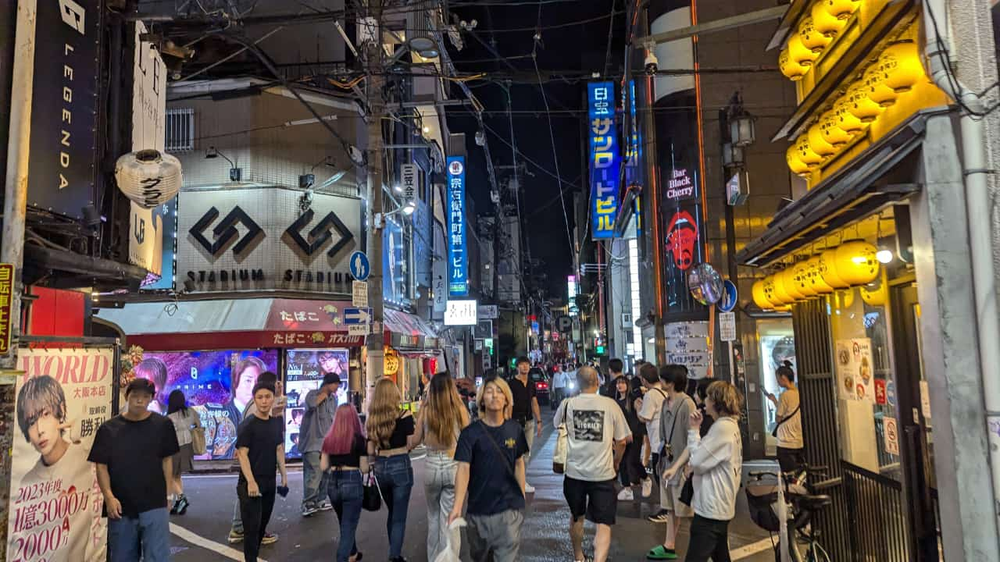
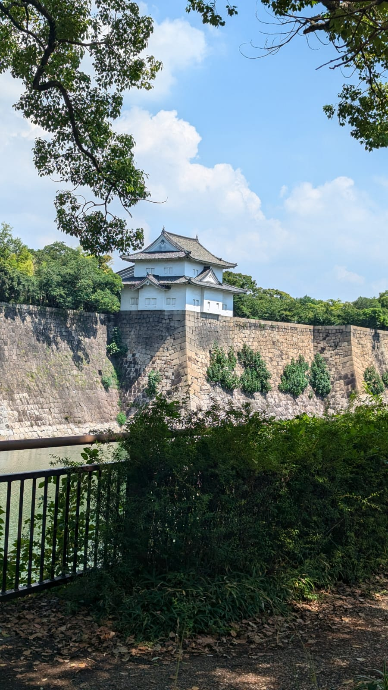
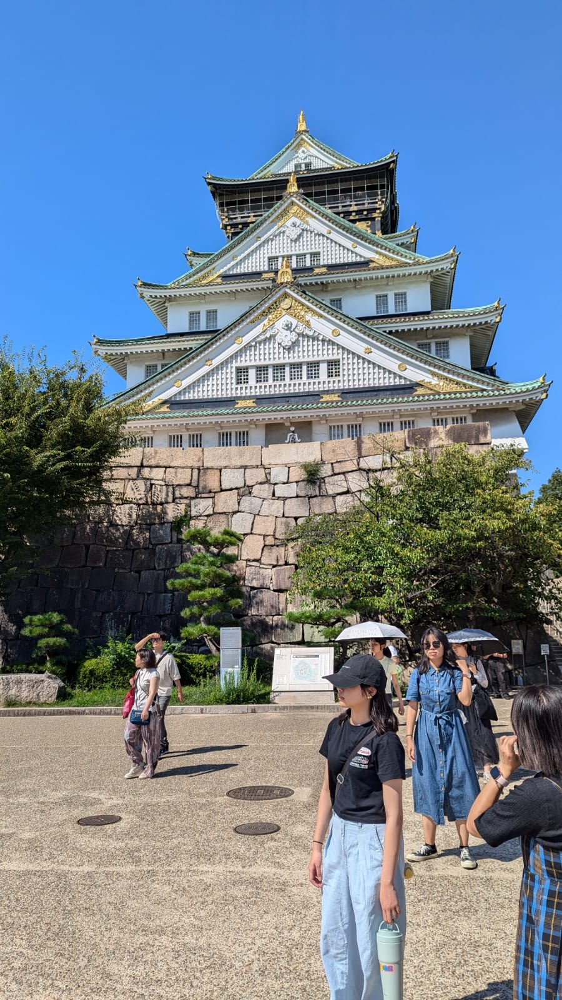
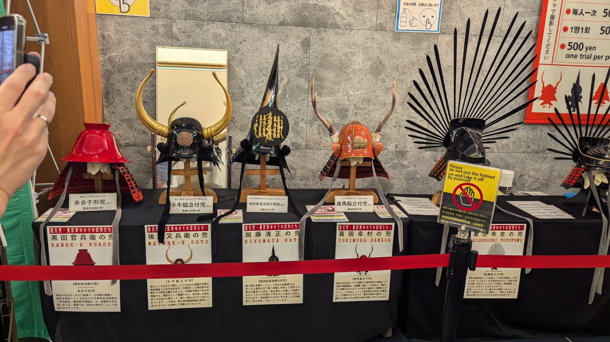
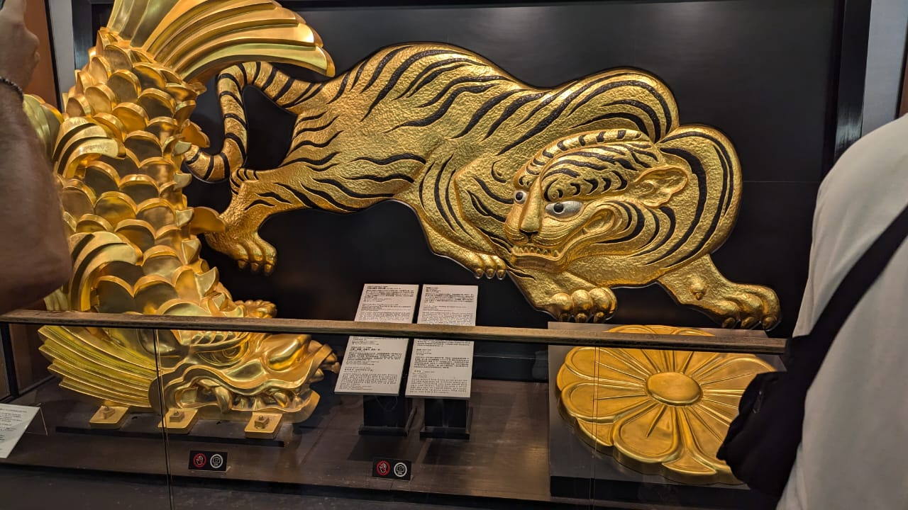
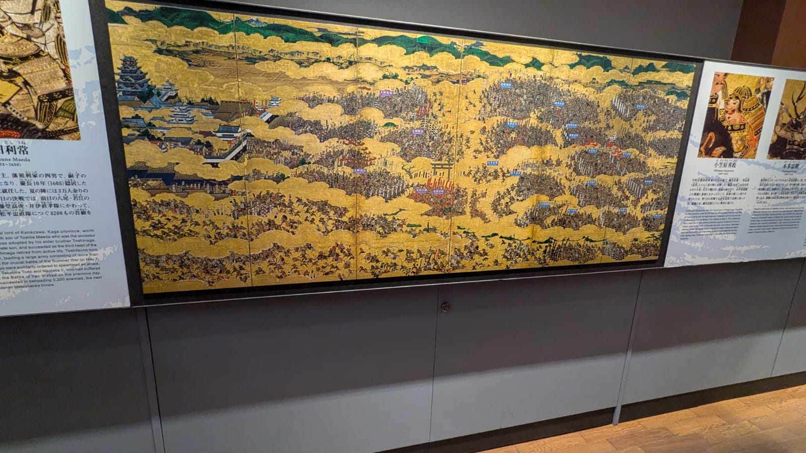
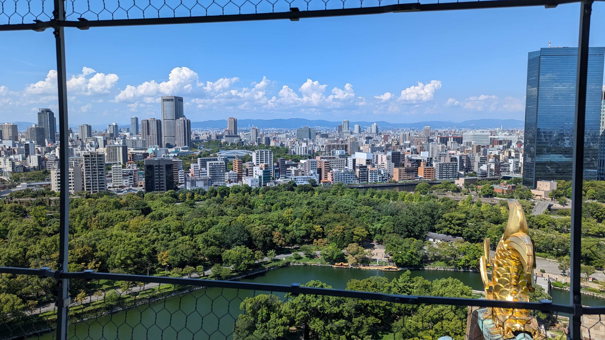
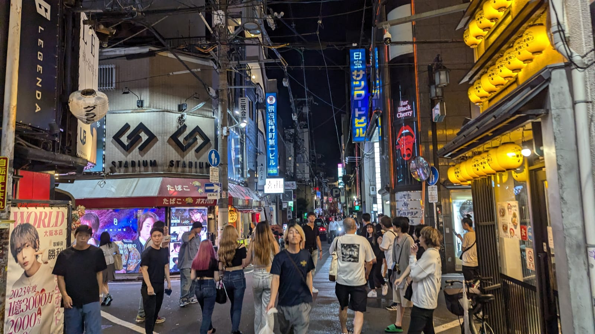

## Crumbling feet

This entry will be rather short. Originally I had plans to expand more on Osaka's famous attractions, such as the *Tsutenkaku*, but I had an unfortunate incident in the afternoon after my trip to the Osaka Castle. I was extremely sweaty from walking tens of thousands of footsteps across Osaka, disorganized from the sun showering the city with its golden heat, forming a tepid atmosphere like no other. My home country isn't as humid or as warm as Osaka, changing weathers then, wasn't going to work to my benefit, along with long walking distances to go from one place to another, something that Japan is famous for.

## Castle

After some good 40 minutes of walking, I finally arrived at the outskirts of the Osaka castle. From the outskirts, you can appreciate the fortress, the aquatic trench reflecting the sun rays and hosting a variety of submarine guards patrolling the perimeter looking (a.k.a fish). To access the castle, walking all the way through the gravy road and then pass the bridge where the aquatic friends live. 

Renowned for it's Winter Siege and Summer war battles that took place back in the Shogunate period of the 1610's, when Japan wasn't an united country, but rather a splintered region of battling shogunates, the castle also holds an important portion of history surrounding the second great unifier of Japan: **Toyotomi Hideyoshi**. 

From the outside I had to stand in a very long queue to access the castle, I was a bit impatient since I wanted to eat something and then head over to the Tsutenkaku, and coupled with my feet screaming at me to finally sit down, I made the mistake of buying the *Osaka Amazing Day Pass* while standing on the line. This wasn't smart at all since I wasn't able to fully take advantage of the other day pass attractions due to the little incident I will mention later in the article, but at least I was able to run straight into the day pass line and save me some precious time.

If you're interested on visiting the castle, make sure you have very comfy shoes and your calves are strong, there's a lot of stairs ( the Castle has a total of 7 floors) so you will be going up and down a lot, it's best to not rest a lot or else you will feel even more tired after you finally stand up, like me =).

### First floor

The castle's first level holds famous Osaka's samurai artifacts from the Edo period (If I recall correctly), there's also something that caught my attention that I also noticed on my trip to Kyoto, about the Tiger rooms/Tiger drawings; basically there were no tigers in Japan back then, so how were artists able to draw tigers at all? You can find out the answer and more about this in my Kyoto article.

### Second floor

The second floor contains more exhibitions about sculptures and portraits in the castle. It explains how *Toyotomi Hideyoshi* modeled the castle after the Azuchi Castle. 

### Third floor

This floor contains some lovely portraits illustrating the famous Osaka Summer war and the Winter Siege. What I admired the most is the level of detail the painting goes into, thousands of soldiers, cavalry, artillery from each side, battle fiercely for controlling the Castle, a decisive victory was later awarded to the Tokugawa shogunate, sealing the fate of the Toyotomi clan and putting an end to the siege of Osaka. There's an informative wall containing all sorts of details about each general of the battle, which is helpful for understanding more about each faction participating in the siege. 

### Fourth floor

The fourth floor contains details concerning the great unifier Toyotomi Hideyoshi, all animated with tiny holograms. It's a biography served in 19 funny displays

### Skipping all the way to THE ROOF

I skipped all the way to the roof afterward. There's an incredible view of Osaka from here, and it was completely worth it destroying my feet soles to feel the wind brace my entire body as I stared deep into the city and its mountains. My hair was pulling tricks on me with the wind and made me look like a maniac, and I wished there was a barber shop on the roof so that I observe the scenery more clearly, oh well..

## The Incident

Remember how I told you a little incident happened while I was visiting Osaka? Well, the incident was just me arriving at the hotel to take a shower before heading out to see *Tsutenkaku* tower. I made mistake of showering with warm water and sitting in the tub relaxing for a good 40 minutes, I immediately felt tired and so I decided to lay over in my bed and browse the internet with my phone. Finally I decided to take a nap and I could've sworn I set the alarm to 40 minutes from now. It was 5pm and I closed my eyes. When I opened them again, it was 11PM, I wasted 5 hours sleeping and now I had little time any place, except for Osaka's bar/night life district; **Shinsaibashisuji**

## Shinsaibashisuji

In this district, you can find a lot of bars with various thematics. In all honesty, I'm remaining sober for the time being, but that doesn't mean you're barred from entering them, you can easily order tasty food (ramen, miso, and a lot of dishes which I have difficulty pronouncing, let alone typing into the article)

Some interesting facts about this district: It has a latin american themed bar, [LUNA SKY International Bar](ghttps://www.google.com/maps/place/LUNA+SKY+International+Latin+Bar/@34.6744362,135.4995199,16z/data=!3m1!4b1!4m6!3m5!1s0x6000e7007c4c24b5:0xa2e55fb9faa857e8!8m2!3d34.6744318!4d135.5020948!16s%2Fg%2F11y2h6ztq1?entry=ttu&g_ep=EgoyMDI0MDkwNC4wIKXMDSoASAFQAw%3D%3D), so if you're a fan of reggaeton and salsa or simply want to experience LATAM in Japan, this is the bar for you. There are also nightclubs and a lot of "servers" who will keep offering you a "night of fun" with their selection of girls. Do not pay attention to them and they will go away on their own.

Youths can be observed walking on the boulevard, some are drunk, some are bold enough to say neutral stuff in front of you (I remember a girl there stared at me and said *Kokku-jin* or something else which I didn't understand immediately)

## Onwards to Fukuoka

Osaka is a very dynamic, modern city, full of things and cultural wonders that make a great impact on the spectator. From it's castles to its shrines, to its vibrant night life, I loved Osaka and so far consider it my favorite city, but sadly I need to leave to explore other places. I'll move to the APA hotel right next to Gion station in Fukuoka, where I'll explore several places such as the Fukuoka Zoo & Botanical Garden, the Wonder World Summer park, the Flower Museum in Uminonakamichi which I failed spectacularly to see, and the outskirts of Marine World. The blog entry is available [here](""). That's it for today's article, until next time.
