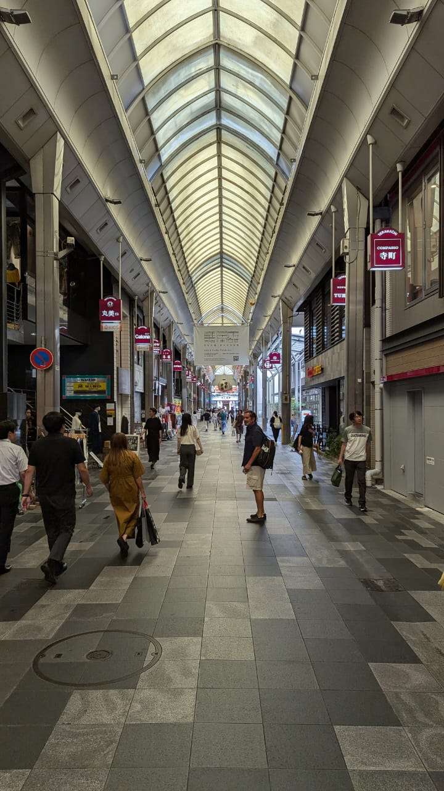
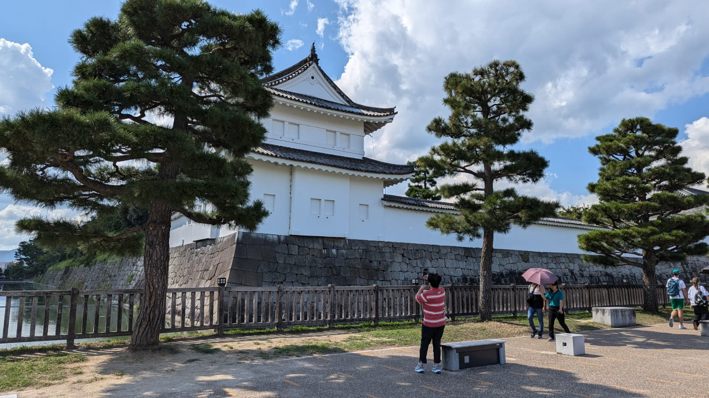
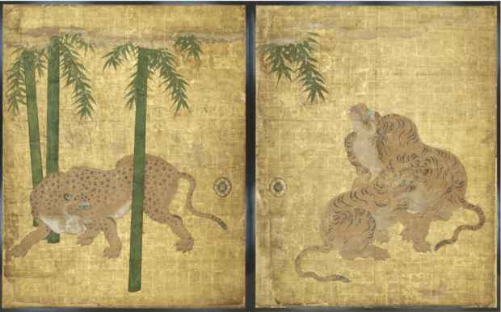
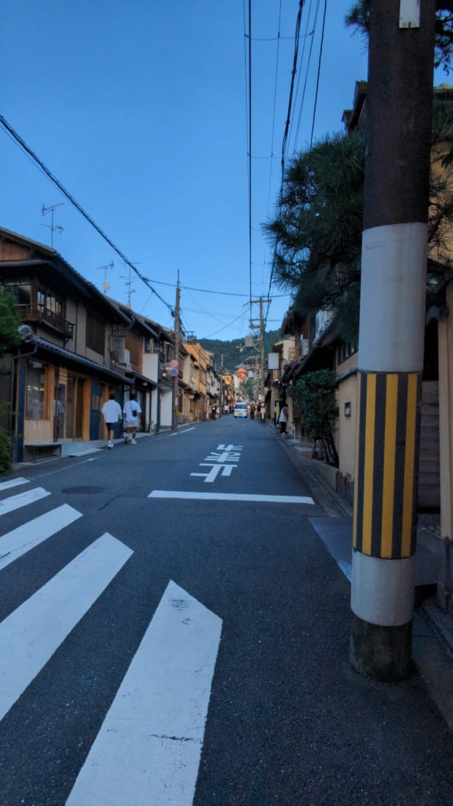
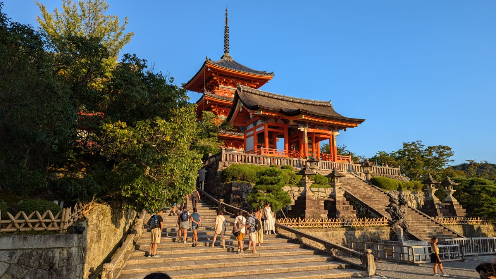
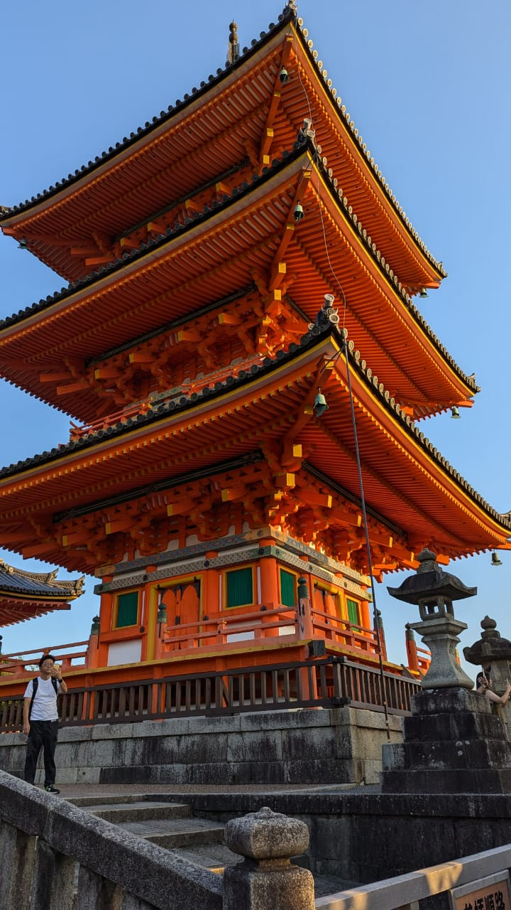
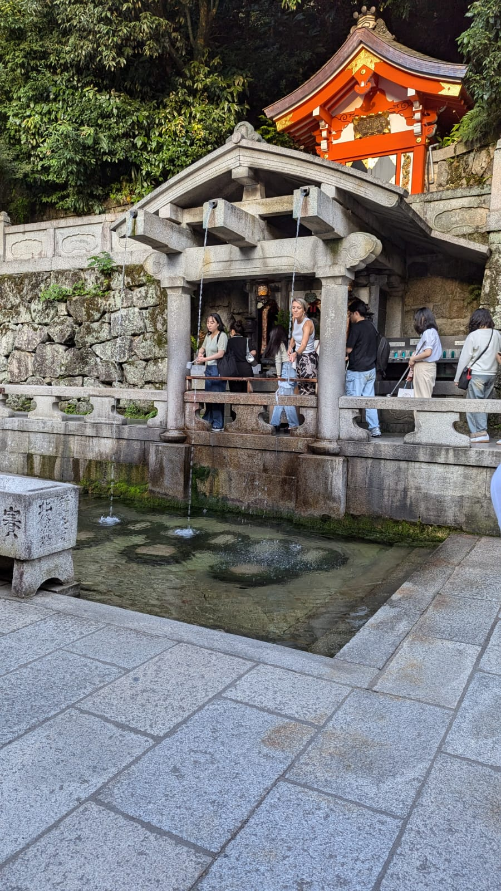
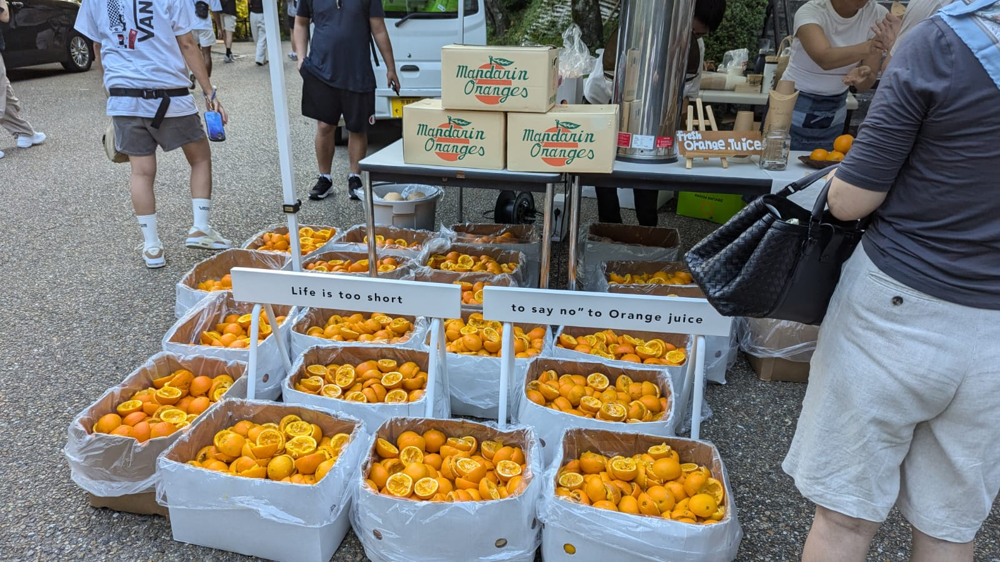

## Kyoto

Kyoto holds a special place in my heart. It is Japan's cultural capital, a place packed with millenia of history, and a place that gained the appreciation of the United States military upper echelons that helped it narrowly avoid nuclear destruction at the end of World War II, the same cannot be said about Hiroshima, the city that took its place and received the first atomic beating.

Kyoto was also the original capital of Japan for almost a thousand years. From 794 to 1868, when the Meiji Restoration occurred in the late 19th century, bringing all of Japan together once and for all.

Arriving at Kyoto from either Tokyo or Osaka is fairly easy, one only needs to take the corresponding local trains to a station that offers Shinkansen to Kyoto. In fact, from Osaka to Kyoto, you can take either the Hankyu Kyoto line, or the Tokaido-Sanyo line, both from the Shin Osaka Station.

## Shinkyogoku Boulevard

Apparently this is a famous boulevard in Kyoto and for a good reason, it holds a lot of antique/traditional stores that sell all sorts of items, from books and poems to traditional food and more modern comestibles. But the main reason I liked this boulevard is that it leads to another Buddhist temple and Swordsmanship museum that features katanas from the great Oda and his disciples. Particularly, I loved the explanation on how samurai swords were crafted. Sadly I couldn't take any pictures from either place since pictures are restricted, but I can assure you it's worthy to visit as a stop before Nijo Castle.

## Nijo Castle

After some good 40 minutes of walking from Kyoto Shijakusho (you don't need to walk that long, this was my mistake), Nijo's castle entrance was just around the corner. The castle appears to be restored, but still I liked the aesthetic from the outside. To access Nijo Castle's interior, you need to purchase a ticket in the entrance outside. It's no more than $5 and it's an amazing experience all around. You can walk around all interior rooms and find great explanations about each of them, such as the famous tiger rooms.

### About the Tiger Rooms

Something that caught my attention, were those rooms covered with paintings of the yellow stripped beasts with eerie eyes; Like a demon possessing the mammal, they stared at you with supernatural intensity and stood out as personal preferences from the painters portraying those giant cats. Well apparently the reason these tigers were painted so differently was due to the fact that Japan back then, didn't have any tigers. Imagine trying to paint a penguin without never having seen one before except for its two wings, its beak and silhouette. Even if you were the world's greatest painter, you wouldn't be able to picture exactly the word penguin, so then you take some inspiration from the chunks of penguin bodies you were provided with. 

That's exactly what happened with these tiger room paintings! Since the artists merely had the tiger hides and other products that came from the tiger, they took some creative liberties to bring the yellow felines into life. Quite interesting isn't it?

## Kiyomizu-dera temple; A gruesome walk

### Mind work

The mind works in mysterious ways, untamed and it will remain an anchor, drowning you. Taming it with persistence and determination however, and it will lead you towards your greatest achievements. I believe this is exactly what happened to me, when climbing to **Kiyomizu-dera**.

### Japan's love for walking

If you ever find yourself in Japan, you will need to come to terms with it's walking distances from one place to another. Renting a car might not be an option for most nationals (nor would I recommend it, it's always a headache to take care of vehicles that aren't yours) and sometimes the places you may want to visit are far away from the nearest station. This is exactly what happened to me when I was recommended a visit to *Kiyomizu-dera*, by a very friendly local, in the ABC-Mart. Originally, I was going to return to Osaka with swollen feet and 5 kilos lighter, from all the sweat I poured over the streets of Kyoto, but, there was something calling me to visit this temple, in hopes of signing off my day in Kyoto, with a spiritual (mis)adventure, despite my legs screaming at me in agony.

### The Climb

Climbing the buddhist temple is no easy task. I had to depart from Kyoto's ABC-Mart - walking - in direction to the monument, and was met with a barrage of *extreme-heat temperature* alerts, a phenomenon that's becoming far more frequent and deadly in Japan as Earth keeps suffocating. The view of the inclined slopes leading to the temple hit my soul with the power of a thousand waves. It's not that I didn't want to continue going, but felt like I couldn't keep going forward. With every step, I felt as if the numbness of my feet crept higher into my body. It's as if it was raining lead on that sunny day, for I felt my whole body heavy, about to fall into the sunset. Almost an hour of agony later, and I finally arrived at the gates of Kiyomizu-dera

### Entrance

Tall, red, concave tiles adorned the roofs of the *pure water temple*, that's the meaning of Kiyomizu-dera in Japanese. Thousands of tourists flooded the entrance, for a moment standing still looking at the wide lenses, the army of cameras immortalized their moments at the shrine in a snap moment. I had a smug grin all of a sudden as I realized my journey in Kyoto was coming to an end, as I headed inside the temple area looking for something. Something that I wasn't even aware of, but it kept calling me, perhaps the Buddhist spirits called me inside to explore the elevated lands and its scenery? 

### Water fountains

I stood amazed at the edge of the hill that gave a sincere view of Kyoto, being swallowed by the sunset, and hastily moved forward before the monks came out to close the temple. I walked all around and down some stairs in the green hills and found the famous blessed water cascade; *Otowo-no-taki*, where there are three fountains of holy water, offers its guests the opportunity to take sacred water from one of its cascades. There's a folklore that says drinking from any of these cascades, will bless the person with love, money and success. I sparkled some of it in my hands, specifically the central cascade's water. I didn't drink it though, so who knows if I ended up blessed, but I'm confident that it was the case =) 

### Orange juice finale

When I had explored all I could of the temple before it closed for the day, I was faced with a final hill to climb to head back to the exit. I'll never forget the happiness I felt after experiencing this precious piece of Kyoto's religious history. The red shrines now behind me, marked a new chapter in my life and made me reflect on a lot of experienced pains I believe, were self=inflicted. A feeling of bliss, knowing that my existence is not just wasting my already frail life force away, in a job I do not like, with limited to no learning, permeated my whole body. Despite my body shutting down on me and praying for a break, atop of this hill I saw myself, and so I took the last steps to receive my reward. 

A tiny kiosk with two Japanese fellows, and a sea of fresh, ripe oranges was awaiting me. The slogan of this orange juice stand, I'll carry for all my life, a golden slogan to all my struggles and challenges I've faced along the way. A nudge that can wake up even the biggest pessimist, from the bluest slumber. A slogan that shall unite all the globe and bring peace to humanity: *Life is too short, to say no to Orange juice.*

Such tastiness.
