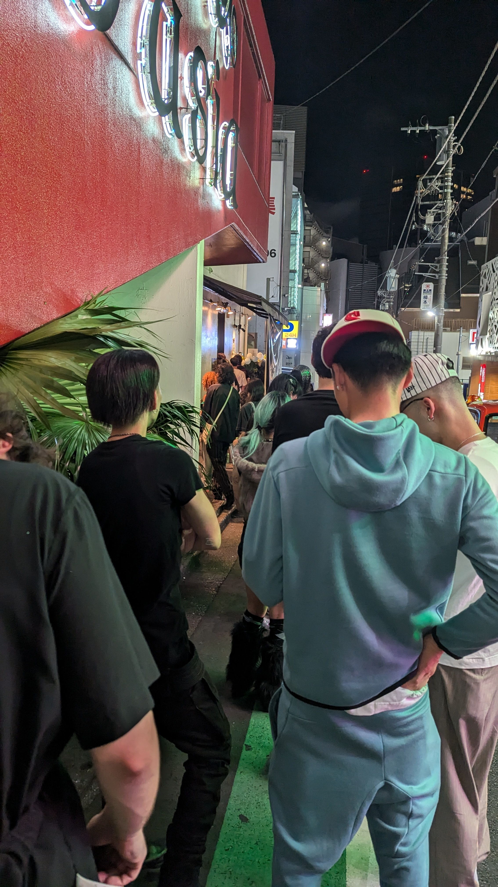

## Prelude

It's been a while since I wrote some entries to the blog. Life got in the way and I needed to rewrite this whole entry, after re-reading it, it doesn't look too good now. The memories of the night at the NEBULA's event remain crystal clear in my mind, however, and I wanted to give a more personal perspective on how a great techno event developed on the night of September 15th, inside the _club Asia_ venue in Shinjuku. But first, an abridged summary on the advent of all music tracks that were going to be produced from that moment forward, through an army of digital instruments, at the fingertips of the artists, or in other words, the rise of **Electronic Music**.

### Once upon a time
In the late 60s Jamaica produced a new genre, a blend of existing sounds in music, manipulated so that the rhythm becomes the foundation of multiple layers of reverb, echo and other musical add-ons, became known as *dub music*. It was an accident, where sound engineer Byron Smith, working at Duke Reid's studio, removed the vocals for the song "On the Beach", from the Paragons. Back then, sound operator "Ruddy" Redwood decided to keep the result as it is and play it at his next dancing event. There's more to the story of Jamaica's outputting of dub music, including where music pioneer Lee "Scratch" Perry played a central role in promoting it with his records. It's incredible to think the world was moving at haste pace towards music created solely by digital instruments living inside the machine. 

What's more amusing, is the inception of machines able to reproduce sounds rapidly proliferating all across the globe, in an independent manner: During the interwar period and during World War II, the USSR, the United States, and Japan were already developing the first electro-musical instruments; Harps, organs and theremins were digitalized and their sounds exposed through recorders; Australia contributed to this technological breakthrough by launching the _CSIRAC_ computer in the early 50s, the very first machine that was able to play music. However, it wasn't until the launch of the _"Ferranti Mark 1"_ computer, that humanity was able to record the first computer generated music tracks. Japan, also played a key-role in shaping the arena for electronic music with the development of the _Yamaha Magna Organ_ in 1935. But again, it wasn't until the 60s when the idea of dwelling into computer generated sounds reached a much wider, daring audience.



In 1969 while conducting an interview for the Rolling Stones, famous poet Jim Morrison went on to predict the rise of solo minds tinkering with digital audio software that served "like an extension to the Moog Synthetizer, but with the richness of a whole orchestra". Electronic music already existed way before Morrison expressed his thoughts during this interview, what matters here is the execution that was unheard of from the days of the Lizard King.

: Kraftwerk, NEU!, Silver Apples, Skrillex")

### From Kraftwerk and NEU! to Silver Apples and Skrillex

In Germany, the electronic music ecosystem was beginning to expand aggressively with the rise of Kraftwerk. Kraftwerk leveraged a lot of electronic sounds with synthetizers to create their own brand of music. Years later, their descendant, NEU!, would go even further with the conceptualization of remixes in the form of slowed-down/sped-up variations of their songs, this is evident in their second album, *NEU! 2* where they decided to release alternate versions of *Super* and *Neuschnee*.

Groups like Stereolab also made use of synthesizers through many of their albums in order to achieve an *avant-garde* set of tunes, seen in their *Dots and Loops* album. Ironically, Stereolab was influenced by *Silver Apples*, the American electronic music group. Still, these were not the groups that Morrison predicted in his interview, I believe he would've been pleased to know that his prediction manifested decades later, with the advent of Skrillex, and DJs, the latter working in their own dubs in a solo manner. I also believe that many DJs took inspiration in at least one of the sources I previously mentioned.

### The French Touch (90s-00s)

The French house scene, serves as a prime example of what happens when youth is allowed to expand on existing foundations, by adding fringe elements to the pitch. Even though they started with little recognition and deviating from the original Euro disco strand floating around the old continent during the 80s, they were able to revolutionize and quickly grow their *repertoire*, attracting millions of fans around the world throughout the process. *Air*, *Daft Punk* and *Justice* are some of the groups that came from this era and they all shared humble origins. Justice started by creating remixes from *Microloisir* in 2003 and rapidly became a powerhouse once their debut album "†" came to be less than 4 years after their initial track compilation. They're a personal favorite of mine due to the fact that "†" was produced with a lot of samples from Apple's sample library and putting them together in Garageband. Obviously this is a gross oversimplification of what they did, but it shows to aspiring electronic music creators how little to no resources, are not a constraint for creativity, in fact, we could say constraints force creativity to the surface.

### The Japanese Electronic Scene

### Special Bio: DJ Emilio (Miguel Emilio Marin Orias)

## Inside the NEBULA X DIMENSION event

### Performance

The event was organized by tico (Costarrican) DJ Emilio, together with a variety of techno artists situated in Japan. Emilio, who moved to Japan more than four years ago to pursue an education in the Japanese language, and subsequently went on to study fashion at the Professional Fashion Institute in Shinjuku, Tokyo, found himself experimenting with sounds through an used synth he acquired back in 2022. From there, he soon found himself participating in local techno venues around Japan, and was now hosting one of the largest events around Shinjuku in the _club asia_ bar, connecting a very diverse demography of electronic music fans, in an arena that could fit multiple DJs simultaneously, in different chambers; Each chamber represented a different world and its sounds did not leak into the other universes. All artists played concurrently at the different stages of the bar.

### Diversity in attendance

Immense cheers and a sense of ecstasy encapsulated what I remember as a very diverse sub-culture, of hard techno-fans jumping and dancing around the _tempos_ of these talented musical artists. In a single night, you could hear a dozen different dialects, a cluster of languages that converged into a single meaning; Love for the spectacle unraveling in front of hundreds of attendees: French, Spanish, Italian, German, English, Japenese were some of the languages I overheard as I was frantically filming the concert and grabbing takes for this blog entry, from a staircase that struggling with supporting my weight and the weight of a couple more fans in the stage. Ethnically speaking, you could spin your head around and find yourself surrounded by people from all the five continents on Earth, what an incredible spectacle.

### Struggles

While the concert was incredibly well organized, a shared problematic currently hovers over the artists shoulder's, an out of off-key note that deafen's both the artists and attendees expectations. "It's the lack of support from local venues, to help emerging artists thrive" - Emilio mentioned to me in one of our many discussions concerning the difficulties DJ's like him face once they try to organize an event such as _NEBULA X DIMENSION_. The sad truth is, logistics, supply chains, strategic locations, all of these responsibilities accrue on the artists, on top of all the track mixing and musical preparations they need to work on, ahead of the big event itself. Promoting these events and giving them enough visibility, is also a pain point that many aspiring electronic music performers have to face nowadays, as mainstream social media such as Instagram, or event organizing apps such as Meetup, don't put them in the spotlight most of the time. The printing and development of t-shirts, and all its logistics falls also in the organizer's shoulders where they can face many setbacks and misunderstandings. There's plenty of opportunity for inventors and creative minds to try and resolve these issues to empower local artists, but unfortunately for now, many artists like Emilio continue to experience these struggles every time they organize a new music festival.

## The next generation of electronica artists

